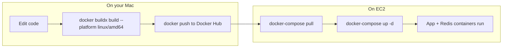
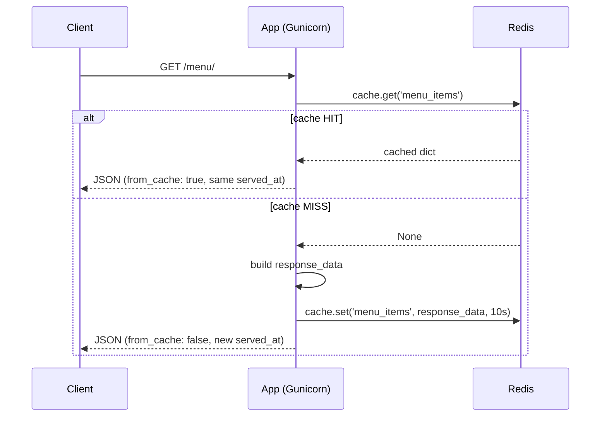
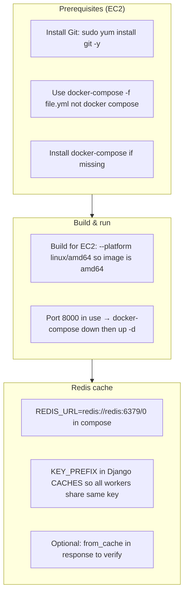
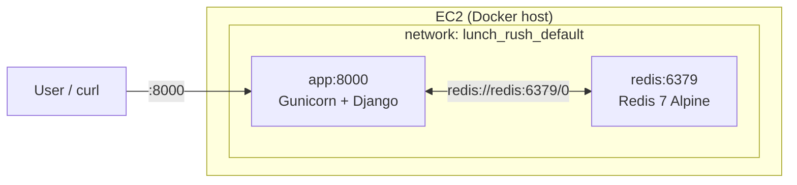
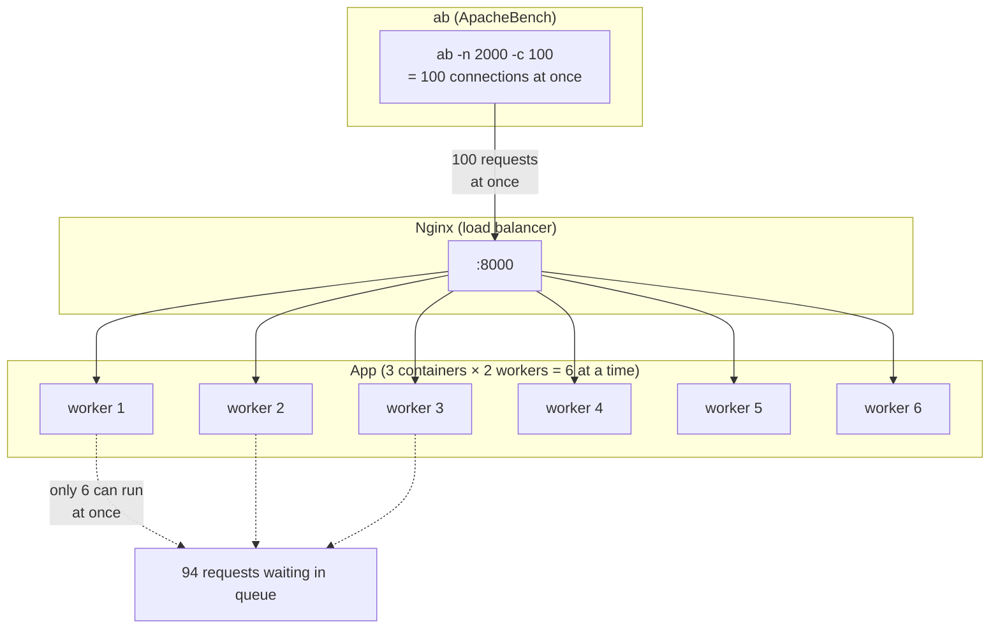
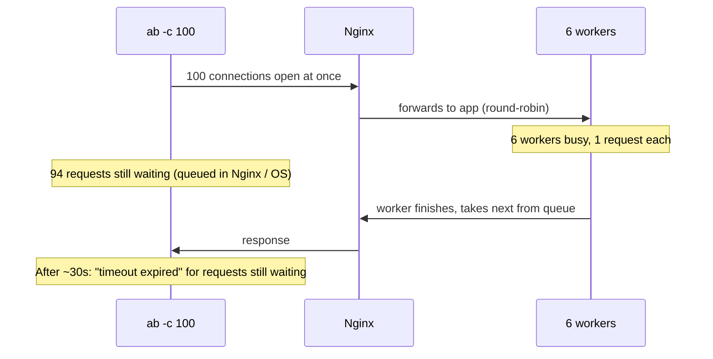
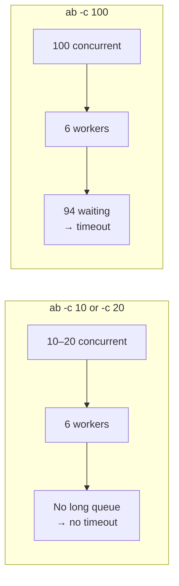

# Lunch Rush: Deployment & Redis Cache Flow

## 1. Deployment flow (Mac → Docker Hub → EC2)



| Step | Where | What you do |
|------|--------|-------------|
| 1 | Mac | Change code in `lunch_rush` |
| 2 | Mac | `cd .../lunch_rush` → `docker buildx build --platform linux/amd64 -t marwansorour08212003/lunch_rush_app:latest --push .` |
| 3 | EC2 | `docker-compose -f docker-compose.prod.yml down` (if needed) → `pull` → `up -d` |
| 4 | — | No build on EC2; it only pulls and runs the image. |

---

## 2. Runtime: request flow and Redis cache

```mermaid
flowchart TB
    Client[Client / curl] -->|:8000| App["App container (Gunicorn)"]
    App -->|GET /menu/| View[menu_views]
    View -->|cache.get('menu_items')| Redis[(Redis container)]
    Redis -->|key exists?| View
    View -->|Yes: return cached JSON| Client
    View -->|No: build response| Set["cache.set(..., timeout=10)"]
    Set --> Redis
    View -->|return JSON + from_cache: false| Client
```



---

## 3. What we had to do to make it work



| Issue | Fix |
|-------|-----|
| `git: command not found` on EC2 | `sudo yum install git -y` |
| `unknown shorthand flag: -f` | Use `docker-compose` (hyphen), or install Compose v2 plugin |
| `no matching manifest for linux/amd64` | On Mac: `docker buildx build --platform linux/amd64 ... --push .` |
| `Bind for 0.0.0.0:8000 failed: port already allocated` | `docker-compose -f docker-compose.prod.yml down` then `up -d` |
| Cache always miss (different `served_at` every time) | Set `KEY_PREFIX: 'lunch_rush'` in `CACHES` in `settings.py` so all Gunicorn workers use the same Redis key |
| Verify cache | Add `from_cache` to JSON response; hit `/menu/` twice → second has `from_cache: true` and same `served_at` |

---

## 4. Architecture overview



- **App container:** Serves HTTP on 8000; uses Django cache (Redis backend).
- **Redis container:** In-memory store; shared by all Gunicorn workers.
- **Compose:** Sets `REDIS_URL` and `depends_on: redis` so the app can reach Redis by hostname `redis`.

---

## 5. Load test: why `ab -c 100` timed out

### Capacity vs concurrency



**What happened:**

| You asked for | What you have | Result |
|---------------|----------------|--------|
| 100 concurrent requests | 6 workers (3 containers × 2 Gunicorn workers) | 6 handle requests; 94 wait in a queue |
| 2000 total requests | ab timeout ~30 s default | After ~30 s ab gives up → "The timeout specified has expired" |
| — | Only 603 completed | The rest were still waiting when ab timed out |

### Request flow over time



### Fix: match concurrency to capacity



- **Use `-c 10` or `-c 20`** so you don’t queue way more than 6 workers can handle.
- Or use **`-s 60`** (longer timeout) if you want to stress-test with `-c 100` and accept that many requests will wait a long time.
